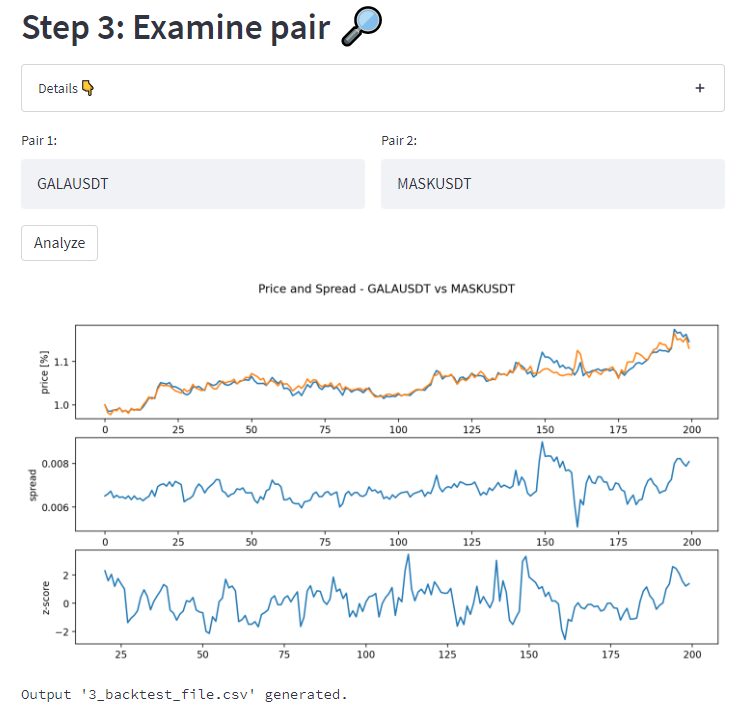

# 💱 Statistical Arbitrage Analysis App

An easy-to-use web app to find crypto arbitrage opportunities and perform backtesting.

The goal for me was to learn about the [streamlit](https://streamlit.io/) library, a powerful tool to create interactive python apps. Also, it simplifies and automates many steps of my previous statistical arbitrage scripts (see [this repo](https://github.com/felixsc1/StatisticalArbitrage) for more details how it works).

## Getting Started

`pip install -r requirements.txt` (tested under python 3.9)

from the main folder start the app with `streamlit run app.py`

Alternatively, you can try out the app without any installation directly on the [streamlit cloud](https://felixsc1-tradebotgui-app-vip1ly.streamlitapp.com/). 🥳

## App Usage

- Fetch all tradeable USDT-Coin pairs from the bybit futures market along with their historic price data.
  

- Calculate cointegration statistics to find potential opportunities.
  

- Plot price curves and statistics of a given pair. Also creates the csv file used for backtesting.
  

- Perform backtesting (i.e. show the performance of the arbitrage strategy when applied on past data of that pair)
  

Expandable text boxes explain each step in more detail.

## Future plans

- More automation. Loop over all potentially profitable pairs and find the best opportunities.

- Create web app also for the execution part, i.e. the actual trading bot.
